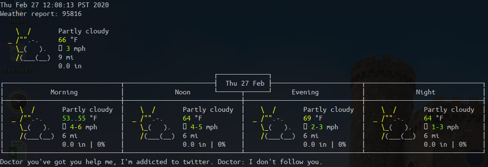

# bashrc-Scripts
Additional, helpful commands to execute and display information when bash is launched.

Displays: 

1. Current weather information and forecast for current day from wttr.in

2. Current date and time

3. System information (CPU, GPU, memory, disks, IP, etc.)

4. A random dad joke

