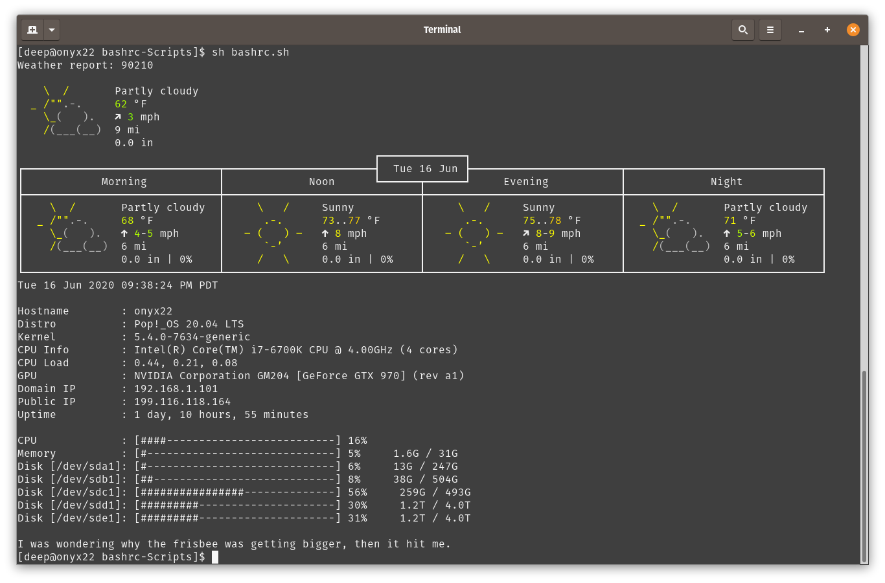

# bashrc Awesome Welcome
Additional, helpful commands that execute and display useful information when bash is launched within a Linux distribution.  Just place the code into your .bashrc file.  

Displays: 

1. Current weather information and forecast for current day from wttr.in

2. Current date and time

3. System information (CPU, GPU, memory, disks, IP, etc.)

4. A random dad joke

